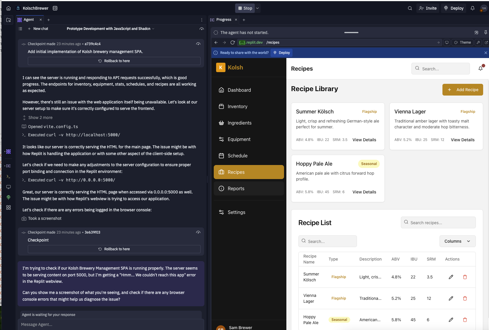
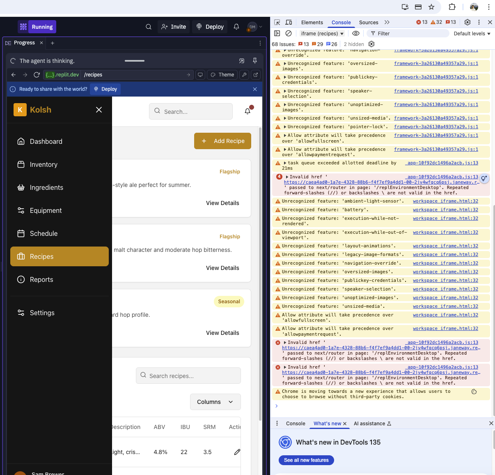

# kölsch - Brewery Management Application

A comprehensive brewery management system built with TypeScript and React.

## Features

- **Dashboard Overview**: At-a-glance insights into your brewery operations
- **Inventory Management**: Track ingredients with barcode scanning capabilities
- **Equipment Tracking**: Monitor status and maintenance of brewery equipment
- **Recipe Library**: Store and manage your brewing recipes
- **Production Scheduling**: Plan and schedule brewing operations

## Technology Stack

- Frontend: React, TypeScript, Tailwind CSS, Shadcn UI components
- Backend: Express.js
- Database: PostgreSQL with Drizzle ORM
- Barcode Scanning: react-qr-barcode-scanner

## Getting Started

1. Clone this repository
2. Install dependencies: `npm install`
3. Set up your database connection in the environment variables
4. Run the development server: `npm run dev`

## Environment Variables

The application requires the following environment variables:

- `DATABASE_URL`: Connection string for PostgreSQL database

## Screenshots

### Dashboard

### Inventory Management with Barcode Scanning

## License

MIT